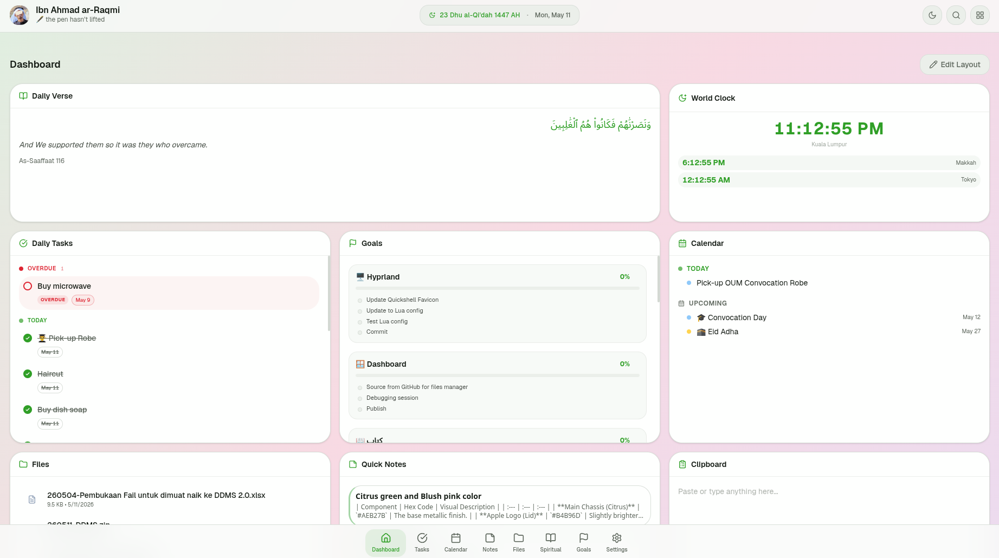

<div align="center">

# ar-Raqmi Dashboard

*Your personal digital sanctuary.*


<br />



</div>

### ✨ Features
- **Customizable Widgets** — Drag, resize, and toggle dashboard modules
- **Productivity Hub** — Tasks, Calendar, Markdown Notes, and Goal Tracking
- **File Manager** — Secure, hierarchical cloud storage
- **Spiritual Tools** — Daily Quran/Hadith, Hijri calendar, and World Clocks
- **Modern Tech** — Real-time sync via Convex and Next.js 16

### 🚀 Quick Start
```bash
# 1. Install dependencies
npm install

# 2. Connect to Convex
npx convex dev

# 3. Create your user
# Run the seed mutation in the Convex dashboard
npx convex dashboard

# 4. Launch the app
npm run dev
```

> **Note:** Use the Convex dashboard to run the `seed:admin` mutation for initial setup.

### 🛠️ The Stack
**Next.js 16** • **Convex** • **Tailwind 4** • **Zustand**

---

<div align="center">

*"Indeed, with hardship comes ease."* — 94:6

*🖋️ the pen hasn't lifted*

</div>
