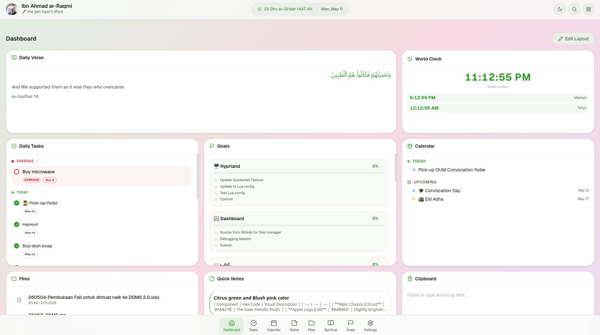

<div align="center">

# Dashboard

*Your personal digital sanctuary.*


<br />



</div>

### ✨ Features
- **Two-Factor Authentication (2FA)** — Enhanced security option with TOTP Authenticator apps (Google Authenticator, Authy, etc.)
- **Customizable Widgets** — Drag, resize, and toggle dashboard modules
- **Productivity Hub** — Tasks, Calendar, Markdown Notes, and Goal Tracking
- **File Manager** — Secure, hierarchical cloud storage powered by Cloudflare R2
- **Spiritual Tools** — Daily Quran/Hadith, Hijri calendar, World Clocks
- **Modern Architecture** — Clean, object-oriented service architecture and Next.js 16 Edge runtime

---

### 🚀 Local Installation & Setup

#### 1. Clone the project and install dependencies
```bash
git clone https://github.com/ar-Raqmi/dashboard.git
cd dashboard
npm install
```

#### 2. Configure Local Environment Variables
Create a `.env` file in the root directory:
```env
# Local SQLite database URL path
DATABASE_URL=file:./db/custom.db

# JWT Secret for local session management
JWT_SECRET=your-local-dev-secret-key-change-in-production
```

Create a `.env.local` file for R2 credentials if you want to test R2 locally:
```env
R2_ACCESS_KEY_ID=your_r2_access_key
R2_SECRET_ACCESS_KEY=your_r2_secret_key
R2_ENDPOINT=https://<account_id>.r2.cloudflarestorage.com
R2_BUCKET_NAME=your-r2-bucket-name
```

#### 3. Initialize the Database
Run the following to set up the local SQLite database schema via Prisma:
```bash
npm run db:push
```

#### 4. Run Development Server
```bash
npm run dev
```
Open [http://localhost:3000](http://localhost:3000) in your browser.

---

### 🌐 Cloudflare Deployment

For security and privacy, configurations like `wrangler.toml` and credentials are not committed to the repository. Follow these steps to deploy to Cloudflare:

#### 1. Create a `wrangler.toml`
Create a local `wrangler.toml` in your project root using the template below:
```toml
name = "personal-dashboard"
compatibility_date = "2025-01-01"
compatibility_flags = ["nodejs_compat"]
pages_build_output_dir = "out"

[[d1_databases]]
binding = "DB"
database_name = "your-d1-database-name"
database_id = "your-d1-database-uuid"

[[r2_buckets]]
binding = "BUCKET"
bucket_name = "your-r2-bucket-name"

[vars]
R2_ENDPOINT = "https://<your_account_id>.r2.cloudflarestorage.com"
R2_BUCKET_NAME = "your-r2-bucket-name"
```

#### 2. Provision Cloudflare Resources
Ensure you are logged in to the Wrangler CLI:
```bash
npx wrangler login
```

Create your D1 Database:
```bash
npx wrangler d1 create dashboard-db
```
*Note: Copy the `database_name` and `database_id` output into your `wrangler.toml`.*

Create your R2 Bucket:
```bash
npx wrangler r2 bucket create your-r2-bucket-name
```

#### 3. Run Production Migrations
Initialize your D1 database with the production schema:
```bash
npx wrangler d1 execute dashboard-db --file=migration.sql
```

#### 4. Configure Production Secrets
Set your production environment secrets on your Cloudflare dashboard (under Pages Project > Settings > Environment Variables) or via CLI:
- `JWT_SECRET`: A secure random string for signing JWT tokens.
- `R2_ACCESS_KEY_ID`: Your Cloudflare R2 Access Key ID.
- `R2_SECRET_ACCESS_KEY`: Your Cloudflare R2 Secret Access Key.

#### 5. Build and Deploy
Run the deploy script to compile the Next.js project and deploy it to Cloudflare Pages:
```bash
# Build the next-on-pages bundle
npm run pages:build

# Deploy the bundle
npm run pages:deploy
```

---

### 🔒 Two-Factor Authentication (2FA) Setup
To enable 2FA:
1. Navigate to **Settings** in the dashboard.
2. Toggle **Two-Factor Authentication**.
3. Scan the generated QR code using any TOTP Authenticator app (e.g., Google Authenticator, Microsoft Authenticator, Authy).
4. Enter the verification code to finalize. Once enabled, future logins will require your password and the dynamic authenticator code.

---

<div align="center">

*"Indeed, with hardship comes ease."* — 94:6

*🖋️ the pen hasn't lifted*

</div>
