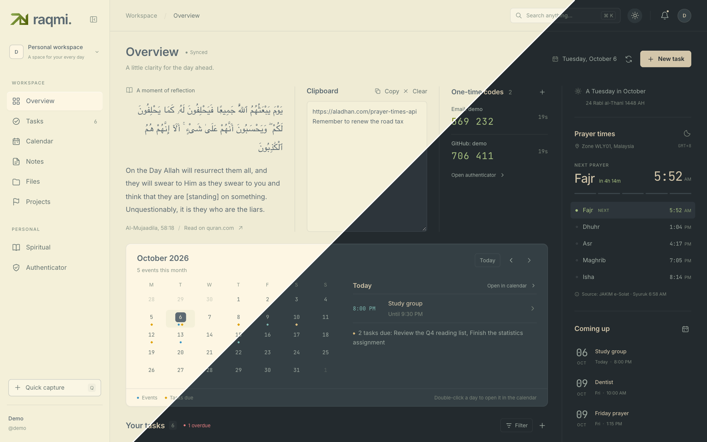

<h1 align="center">dashboard</h1>
<p align="center">
  
</p>
<p align="center">
  <video src="https://github.com/user-attachments/assets/7c73e2ca-af91-4f5d-bf11-c9de301469a0" controls muted width="100%"></video>
</p>
<p align="center">
  <strong>One calm place for tasks, notes, files and the daily prayer times.</strong>
</p>
<p align="center">
  
  
  
  
</p>

A personal workspace in the Everforest palette: tasks, calendar, notes, goals, files, a prayer-times page and a 2FA code generator, in one installable app that runs on your own Cloudflare account. Built with Vite, React 19 and TypeScript on Cloudflare Pages, D1 and R2.

## Why this exists

My tasks lived in one app, my notes in another, my files somewhere else, and the prayer times in a fourth tab. I wanted all of it in one place that I own: my account, my database, my storage.

It is also built to travel. The time zone, the prayer-times location and the Hijri calendar are all settings, not hardcoded, so changing country is a few clicks and not a code change.

It is single-user by design: there is no sign-up screen, and you create the login yourself (see [Quick start](#quick-start)).

## What's inside

**Work**
- **Tasks** with priorities, due dates and repeating schedules (RRULE). Goals double as projects.
- **Calendar** with repeating events and per-occurrence exceptions.
- **Notes** in Markdown: GitHub-style tables, footnotes and task lists, sanitised with DOMPurify. Code highlighting only loads when a note contains code.
- **Goals** with milestones.
- **Files** in Cloudflare R2: folders, uploads, rename, move, star, thumbnails for images and video, and zip download.

**Daily**
- **Spiritual**: a daily ayah (Arabic with English), a hadith, prayer times and the Hijri date.
- **Authenticator**: a TOTP code generator for your other accounts.
- **World clocks** and a cross-device **clipboard**.

**Feels like an app**
- Light and dark Everforest themes, a ⌘K search palette and [keyboard shortcuts](#keyboard-shortcuts).
- An installable PWA with an offline screen.
- Export the whole workspace to JSON, or save a screenshot of the page.

## Make it yours

Everything below is under **Settings**.

| Setting | What you can change |
| --- | --- |
| Brand name | The `raqmi.` wordmark in the sidebar, sign-in screen, footer and tab title. The installed app is always called "Dashboard". |
| App icon | The Raqmi mark, the original feather pen, a few other icons, or your own image by upload or by link. It changes the sidebar, sign-in and tab icon. |
| Time zone | Follow the device (so travelling needs nothing) or pin any IANA zone. "Today" means today in that zone everywhere. |
| Date format | `dd/mm/yyyy`, `mm/dd/yyyy`, ISO, or any pattern you write with `d`, `m`, `y` and `eee` for the weekday. Date boxes follow it too. |
| Prayer times | [JAKIM e-Solat](https://www.e-solat.gov.my/) (any of its 60 zones) or [Aladhan](https://aladhan.com/) by city or GPS, with a calculation method and Asr school. |
| Hijri date | JAKIM's moon sighting, Umm al-Qura, the Saudi Hijri council, Diyanet or an astronomical calculation. The day can change at midnight or at Maghrib, with a ±3 day adjustment. |
| Profile, widgets, clocks | Display name, profile picture, which Overview widgets show, and your world clocks. |

JAKIM and the published calendars can disagree by a day, so the Hijri source is your choice. Always check your local mosque for verified times.

## Quick start

You need **Node 20.19 or newer**. A Cloudflare account is only needed to deploy; local development uses Wrangler's emulated D1 and R2.

```bash
git clone https://github.com/ar-Raqmi/dashboard.git
cd dashboard
npm install

cp .dev.vars.example .dev.vars          # then set JWT_SECRET inside it
cp wrangler.toml.example wrangler.toml  # local config, gitignored
```

D1 and R2 are **bindings** declared in `wrangler.toml`, not environment variables, and `JWT_SECRET` is the only secret the app reads. Wrangler keeps the local data under `.wrangler/`.

Create the local database and your login:

```bash
npx wrangler d1 migrations apply dashboard-db --local
node scripts/seed-admin.mjs you 'your-password' > .wrangler/seed.sql
npx wrangler d1 execute dashboard-db --local --file=.wrangler/seed.sql
```

Use the `database_name` from `wrangler.toml` instead of `dashboard-db` if you changed it. Then run it:

```bash
npm run preview      # builds, then serves the app and its API on http://localhost:8788
```

The API only exists as Pages Functions, so `npm run preview` is the one that has to run. For hot reload, keep it running in one terminal and start `npm run dev` in another; Vite proxies `/api` to `:8788`.

| Script | Does |
| --- | --- |
| `npm run dev` | Vite dev server (frontend only, `/api` proxied to `:8788`) |
| `npm run build` | Type-check, then build to `dist/` |
| `npm run typecheck` | `tsc -b` over the app and the functions |
| `npm run preview` | Build, then `wrangler pages dev` |
| `npm run deploy` | Build, then publish to production (see below) |

## Deploy

Deployment is Cloudflare Pages with a D1 database and an R2 bucket.

```bash
npx wrangler login
npx wrangler d1 create <your-db-name>              # put the name and id in wrangler.toml
npx wrangler r2 bucket create <your-bucket-name>   # put the name in wrangler.toml
npx wrangler d1 migrations apply <your-db-name> --remote

npx wrangler pages secret put JWT_SECRET --project-name=<project> --env=production
npx wrangler pages secret put JWT_SECRET --project-name=<project> --env=preview
```

Add your login to the remote database the same way as locally, with `--remote` instead of `--local`.

The `deploy` script in `package.json` has the author's project name in it (`ar-raqmi`). Change `--project-name` before you run it on your own account:

```bash
npm run deploy
```

> [!IMPORTANT]
> `npm run deploy` publishes with `--branch=main`, which **replaces the production site**. Apply new migrations to the remote database first. To try a build instead, run `npm run build && npx wrangler pages deploy dist --project-name=<project> --branch=<another-branch>`. That preview reads the **same D1 and R2** as production.

> [!WARNING]
> Preview and production have separate secrets. A `JWT_SECRET` set for production is not available to preview branches, so set both or the Authenticator shows as locked there.

To install it as an app, open the site in Chrome, Edge or Helium and use the browser's install option, or **Settings → App**. Safari on Mac uses Share → Add to Dock.

## Authenticator

The Authenticator stores TOTP secrets for **your other accounts** (GitHub, email and so on) and shows their current and next 6-digit codes, like Google Authenticator. Signing in to the dashboard itself uses only a username and password.

To add an account:
1. Open **Authenticator** in the sidebar.
2. Enter the account name and paste the service's **Base32 setup key**, the text secret shown next to the QR code (often behind "Can't scan it?"). There is no QR scanning. Spaces and dashes are removed, and the key needs at least 16 Base32 characters.
3. Optionally give it a category.

Secrets are encrypted with AES-GCM, using the first 32 characters of `JWT_SECRET` as the key.

> [!IMPORTANT]
> **`JWT_SECRET` protects every stored 2FA secret.**
> - If it is **missing**, there is no fallback key. The Authenticator shows as **locked**, shows no codes and refuses to add or change anything.
> - If it **changes**, old entries can no longer be decrypted. They are marked **undecryptable** and never show a wrong code. Keep the secret stable, or re-add the accounts after changing it.
> - Use the same value locally (`.dev.vars`) as in production if your local setup reads production data.

## Keyboard shortcuts

| Keys | Action |
| --- | --- |
| <kbd>Ctrl</kbd>/<kbd>⌘</kbd> + <kbd>K</kbd> | Open or close the search palette |
| <kbd>/</kbd> | Open search from anywhere |
| <kbd>Ctrl</kbd>/<kbd>⌘</kbd> + <kbd>B</kbd> | Collapse or expand the sidebar |
| <kbd>N</kbd> | New task |
| <kbd>Q</kbd> | Quick capture (a new note) |
| <kbd>Esc</kbd> | Close menus and dialogs |

The single-letter keys do nothing while you are typing in a field or while a dialog is open. In the search palette, <kbd>↑</kbd> and <kbd>↓</kbd> move between results and <kbd>Enter</kbd> opens one.

## The downsides

- **One user.** There is no sign-up and no sharing, and every query is scoped to a single account.
- **Cloudflare only.** It uses D1, R2 and Pages Functions directly, so moving to another host means rewriting `server/`.
- **Offline is only the shell.** The app opens offline, but your data needs a connection. Nothing is cached from the API on purpose.
- **Prayer times need the internet.** They come from JAKIM and Aladhan, and are cached at the edge for a few hours. If a source is down, the page says so and does not fall back to another one.
- **Aladhan guesses unknown cities.** Check the time zone shown next to the times, or use coordinates.
- **JAKIM is Malaysia only.** Outside Malaysia, use Aladhan.
- **The Authenticator has no QR scanner**, and its key is the first 32 characters of `JWT_SECRET`, not a derived key.
- **No automated tests yet.** `npm run typecheck` and the build are the only checks.

## Contributing

Bug reports and ideas are welcome as issues. Run `npm run typecheck` and `npm run build` before sending a change, and see [`CLAUDE.md`](CLAUDE.md) for how the code is organised and the conventions it follows.

---

<div align="center">

*"Indeed, with hardship comes ease."* — 94:6

*🖋️ the pen hasn't lifted*

</div>
